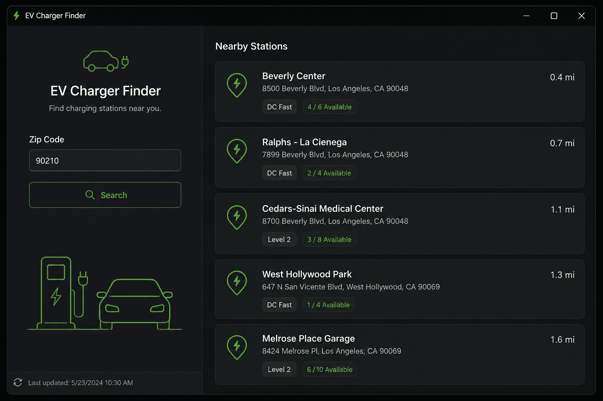
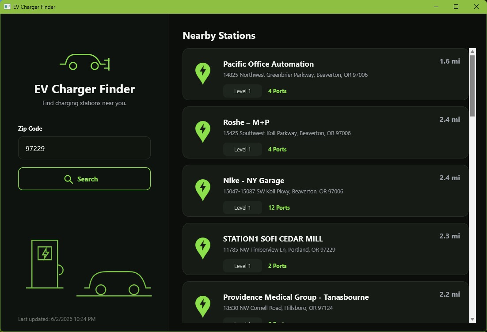

# EV Charger Finder

---
#### NOTE: This was directly inspired by [Sarina Dupont's blog](https://blogs.embarcadero.com/vibe-coding-with-kai-building-a-real-vcl-windows-app-from-a-simple-prompt/) about the new Embarcadero product, [Kai](https://www.embarcadero.com/products/rad-studio/kai), where she vibe-coded this app. I simply wanted to see how well Claude Code could build a Firemonkey version of the same thing (her's was a VCL app). My effort took about three hours, including only minor tweaks of the code, some editing of the documentation, and creating this repository.

---

A Delphi **FireMonkey (FMX)** desktop application that finds EV charging
stations near a ZIP code. Enter a ZIP, press **Search**, and you get a
scrollable list of nearby stations showing the **distance**, **charger type**
(DC Fast / Level 2 / Level 1), and the **number of charging ports** — styled
after `EVChargerMockup.png`.



## Data sources (free APIs)

A search makes two calls:

1. **ZIP → coordinates** via **Zippopotam.us** — no key required:

   ```
   https://api.zippopotam.us/us/<ZIP>
   ```

2. **Nearby stations** via **Open Charge Map** — a global, community-run EV
   charging database:

   ```
   https://api.openchargemap.io/v3/poi?output=json&countrycode=US
       &latitude=<LAT>&longitude=<LON>&distance=30&distanceunit=Miles&maxresults=20
   ```

   Open Charge Map returns each station's distance, address, connection types
   (CCS, CHAdeMO, Type 2, …) and power, from which the app derives the charger
   type (**DC Fast** ≥ 50 kW, **Level 2** ≥ 7 kW, otherwise **Level 1**) and a
   port count.

### Open Charge Map API key (recommended)

OCM works without a key for light use, but a free key removes throttling. The
key is kept out of source control via a git-ignored include file:

1. **Copy `ApiKeys.inc.template` to `ApiKeys.inc`** (same folder, drop the
   `.template`). `ApiKeys.inc` is listed in `.gitignore`, so your key is never
   committed.
2. Sign in at **https://openchargemap.org/site/loginprovider/beginlogin** and,
   under **My Profile ▸ My Apps**, create an application to get a key.
3. Paste the key into `ApiKeys.inc`:

   ```pascal
   OCM_KEY = 'your-key-here';   // or leave '' to run keyless
   ```

`MainForm.pas` pulls it in with `{$I ApiKeys.inc}`, so the build needs
`ApiKeys.inc` to exist — copying the template (even unedited) is enough.

> Note: OCM exposes the *number of charge points* but not live real-time
> availability, so each card shows the total port count rather than an
> "x / y available" figure.

## Building & running

1. Open `EVChargerFinder.dproj` in the RAD Studio / Delphi IDE (should work from Delphi 11 Alexandria or up; I tested it with Delphi 13 Florence)
2. Set your API Key in the include file (see comments above for `ApiKeys.inc`)
3. Press **Run** (F9)

The IDE generates `EVChargerFinder.res` automatically on the first build.

## Project layout

| File                  | Purpose                                              |
|-----------------------|------------------------------------------------------|
| `EVChargerFinder.dpr` | Program entry point.                                 |
| `EVChargerFinder.dproj` | MSBuild project (Win32/Win64 targets).             |
| `MainForm.fmx`        | Main window UI, laid out as design-time components.  |
| `MainForm.pas`        | Event handlers + NREL API call & JSON parsing.       |
| `StationCard.fmx`     | Design-time layout for one station row (a `TFrame`). |
| `StationCard.pas`     | `TStation` record + `SetData` to fill a card.        |

The two panels, the ZIP input, the search button and the station-row frame
are all real components you can open and tweak in the FireMonkey form
designer. The only things built in code are the decorative vector icons (TPath
geometry doesn't round-trip cleanly as form text) and the variable-length list
of result rows (one `TStationCard` frame instantiated per station).

## Notes & next iterations

- The UI was originally constructed entirely in code so the look matches the mockup
  precisely without shipping a custom FMX style file; but I like to see things at design-time so instructed Claude to change it (besides, it took much longer to draw it from code than to stream it from the .dfm).
- The network request runs on a background thread (`TTask`); results are
  marshalled back to the UI thread via `TThread.Queue`.
- Planned follow-ups: a map view, real-time availability where networks expose
  it, filtering by charger type/connector, and Android/iOS targets (FireMonkey
  makes this mostly a recompile).

## Screenshot

When running on my Windows machine, this is what it looks like:




